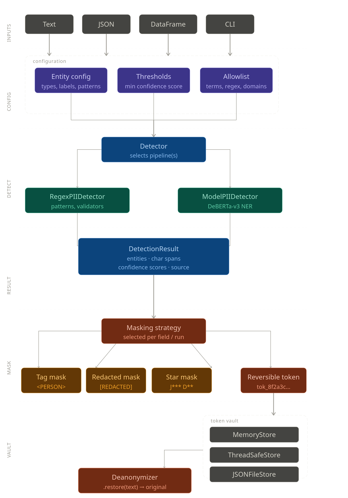
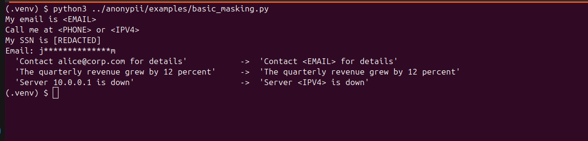
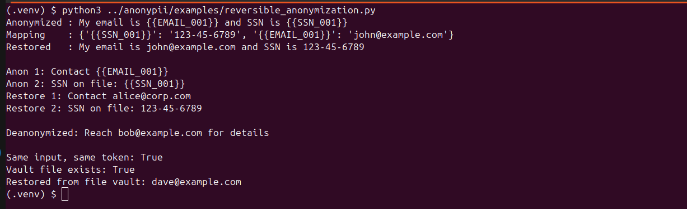
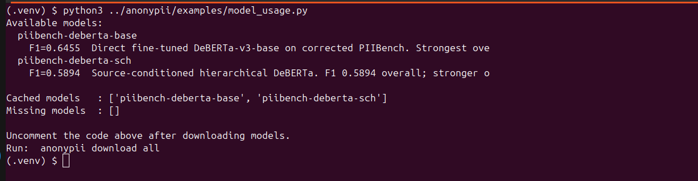

# anonypii

Production-grade PII detection, masking, and reversible anonymization for Python.

anonypii helps you redact sensitive text before logging, sharing, indexing, or sending it to downstream systems. It works immediately with a regex detector and can scale up to two fine-tuned DeBERTa-v3-base models trained from the PIIBench research line.

| Model | Hugging Face | Full-test F1 | Best use |
|---|---|---:|---|
| `piibench-deberta-base` | [Pritesh-2711/piibench-deberta-base](https://huggingface.co/Pritesh-2711/piibench-deberta-base) | **0.6455** | Recommended default; wins 54/82 entity types |
| `piibench-deberta-sch` | [Pritesh-2711/piibench-deberta-sch](https://huggingface.co/Pritesh-2711/piibench-deberta-sch) | 0.5894 | Stronger on 28/82 types including `HTTP_COOKIE`, `DATE_TIME`, and `PHONE_NUMBER` |

Both models cover all **82 entity types** across 10 coarse categories: `CREDENTIAL`, `FINANCIAL_ID`, `CONTACT`, `NETWORK`, `LOCATION`, `PERSON_GROUP`, `ORG_ROLE`, `TEMPORAL`, `MISC`, and `FINANCIAL_NER`.

---

## Architecture



The core pipeline is intentionally small: detectors return spans, strategies decide replacements, and vaults store reversible token mappings. This keeps the public API predictable while still allowing custom detectors, patterns, masking strategies, and storage backends.

## Installation

```bash
# Core library only: regex detector, no model download
pip install anonypii

# Model support: torch, transformers, huggingface-hub
pip install anonypii[model]

# Model support, with optional build-time auto-download hook
# Set ANONYPII_AUTO_DOWNLOAD=1 to download during installation
pip install anonypii[models]

# pandas DataFrame helpers
pip install anonypii[pandas]

# Everything
pip install anonypii[all]
```

Download models manually:

```bash
anonypii download all
anonypii download piibench-deberta-base
anonypii download piibench-deberta-sch
```

Or auto-download at runtime:

```python
from anonypii.detectors.model import ModelPIIDetector

detector = ModelPIIDetector(model="piibench-deberta-base", download=True)
```

## Quickstart

### Irreversible Masking

```python
from anonypii import Anonymizer

anon = Anonymizer(model="piibench-deberta-base", download=True)

anon.mask("My email is john@example.com")
# "My email is <EMAIL>"

anon.mask("SSN: 123-45-6789 and card 4111-1111-1111-1111")
# "SSN: <SSN> and card <CREDIT_CARD>"
```

### Reversible Anonymization

```python
from anonypii import Anonymizer

anon = Anonymizer(model="piibench-deberta-base", download=True)

result = anon.anonymize("My email is john@example.com")
print(result.text)      # "My email is {{EMAIL_001}}"
print(result.restore()) # "My email is john@example.com"
```

### No-Download Regex Mode

```python
from anonypii import Anonymizer
from anonypii.detectors.regex import RegexPIIDetector

anon = Anonymizer(detector=RegexPIIDetector())
print(anon.mask("john@example.com / 123-45-6789"))
# "<EMAIL> / <SSN>"
```

## CLI

The CLI uses the model detector by default, so install model extras and download a model before running detection commands:

```bash
pip install anonypii[model]
anonypii download piibench-deberta-base

anonypii detect "My email is john@example.com"
anonypii mask "My email is john@example.com"
anonypii anonymize "My email is john@example.com" --output-mapping mapping.json
anonypii restore "My email is {{EMAIL_001}}" --mapping mapping.json
anonypii info
anonypii download all
```

## Examples

Runnable examples live in [`examples/`](examples/):

| Example | What it shows |
|---|---|
| [`basic_masking.py`](examples/basic_masking.py) | Tag, redacted, star, and batch masking with regex detection |
| [`reversible_anonymization.py`](examples/reversible_anonymization.py) | Stateless restore, stateful vault restore, deterministic tokens, JSON vault |
| [`model_usage.py`](examples/model_usage.py) | Model registry, download status, model detector setup |
| [`dataframe_pipeline.py`](examples/dataframe_pipeline.py) | pandas DataFrame anonymization pipeline |
| [`custom_detector.py`](examples/custom_detector.py) | Injecting a custom detector |
| [`custom_entity_config.py`](examples/custom_entity_config.py) | Restricting active entity types and groups |

## Benchmarks

The bundled model registry tracks the held-out PIIBench full-test metrics used by anonypii:

| Model | Precision | Recall | F1 | Notes |
|---|---:|---:|---:|---|
| `piibench-deberta-base` | 0.6277 | 0.6645 | **0.6455** | Best overall; recommended default |
| `piibench-deberta-sch` | 0.5560 | 0.6270 | 0.5894 | Stronger on selected source-conditioned and hierarchical cases |

PIIBench contains 100,002 full-test records and 82 fine-grained PII entity types. The base model wins 54 entity types overall; the SC+H model wins 28 types and remains useful for targeted evaluation.

## Screenshots and Demos

### Basic Masking



### Reversible Anonymization



### Model Usage



## Masking Strategies

```python
from anonypii.masking.strategies import (
    TagMaskingStrategy,        # <EMAIL>
    RedactedMaskingStrategy,   # [REDACTED]
    StarMaskingStrategy,       # j**************m
    TokenMaskingStrategy,      # {{EMAIL_001}}
)

anon = Anonymizer(
    detector=...,
    strategy=StarMaskingStrategy(keep_start=1, keep_end=1),
)
```

## Entity Configuration

Restrict detection to specific entities or entire coarse groups with YAML or JSON:

```yaml
schema_version: "1.0"

active_entity_types:
  - EMAIL
  - SSN
  - CREDIT_CARD

active_coarse_groups:
  - CREDENTIAL
  - FINANCIAL_ID
```

```python
anon = Anonymizer(config_path="my_config.yaml", ...)
```

## Allowlist

```python
import re
from anonypii.detectors.regex import RegexPIIDetector

detector = RegexPIIDetector(
    allowlist=[
        "noreply@company.com",
        re.compile(r".*@internal\.com$"),
    ]
)
```

## Vault Options

```python
from anonypii import ReversibleAnonymizer
from anonypii.vault.memory import InMemoryVault, ThreadSafeInMemoryVault
from anonypii.vault.json_file import JsonFileVault

ra = ReversibleAnonymizer(
    detector=...,
    vault=JsonFileVault("~/.anonypii/vault.json"),
)
```

## DataFrame Processing

```python
import pandas as pd
from anonypii import Anonymizer
from anonypii.io.dataframe import process_dataframe

df = pd.DataFrame({"email": ["alice@x.com"], "notes": ["SSN 123-45-6789"]})
redacted_df, results = process_dataframe(df, Anonymizer(...))
```

## Entity Types

| Coarse group | Entity types |
|---|---|
| CREDENTIAL | `SSN`, `PASSWORD`, `API_KEY`, `PIN`, `PASSPORT_NUMBER`, `DRIVER_LICENSE`, `TAX_ID`, `NATIONAL_ID`, ... |
| FINANCIAL_ID | `CREDIT_CARD`, `IBAN`, `ACCOUNT_NUMBER`, `BANK_ROUTING_NUMBER`, `BIC`, `SWIFT_BIC`, `CVV`, ... |
| CONTACT | `EMAIL`, `PHONE`, `PHONE_NUMBER`, `FAX_NUMBER` |
| NETWORK | `IP_ADDRESS`, `IPV4`, `IPV6`, `MAC_ADDRESS`, `URL`, `USERNAME`, `HTTP_COOKIE`, `DEVICE_IDENTIFIER` |
| PERSON_GROUP | `PERSON`, `FIRST_NAME`, `LAST_NAME`, `NAME`, `AGE`, `GENDER` |
| LOCATION | `ADDRESS`, `CITY`, `STATE`, `COUNTRY`, `POSTCODE`, `COORDINATE`, `STREET_ADDRESS`, ... |
| ORG_ROLE | `ORG`, `COMPANY`, `COMPANY_NAME`, `JOB`, `OCCUPATION` |
| TEMPORAL | `DATE`, `TIME`, `DATE_TIME`, `DATE_OF_BIRTH` |
| MISC | `CRYPTO_ADDRESS`, `VEHICLE`, `CURRENCY`, `AMOUNT`, `BLOOD_TYPE`, `LICENSE_PLATE`, ... |
| FINANCIAL_NER | `FINANCIAL_ENTITY` |

## Research Links

- **Dataset**: [PIIBench: A Unified Multi-Source Benchmark Corpus for PII Detection](https://arxiv.org/abs/2604.15776) - Jha (2026)
- **Models**: [Fine-Tuning Over Architectural Complexity: PII Detection on PIIBench with DeBERTa](https://arxiv.org/abs/2605.25816) - Jha (2026)
- **Models on Hugging Face**: [piibench-deberta-base](https://huggingface.co/Pritesh-2711/piibench-deberta-base), [piibench-deberta-sch](https://huggingface.co/Pritesh-2711/piibench-deberta-sch)


## Citation

If anonypii, PIIBench, or the released models help your work, please cite:

```bibtex
@misc{jha2026piibench,
  title = {PIIBench: A Unified Multi-Source Benchmark Corpus for PII Detection},
  author = {Jha, Pritesh},
  year = {2026},
  eprint = {2604.15776},
  archivePrefix = {arXiv},
  primaryClass = {cs.CL}
}

@misc{jha2026debertapii,
  title = {Fine-Tuning Over Architectural Complexity: PII Detection on PIIBench with DeBERTa},
  author = {Jha, Pritesh},
  year = {2026},
  eprint = {2605.25816},
  archivePrefix = {arXiv},
  primaryClass = {cs.CL}
}
```

## License

Apache License 2.0 - see [`LICENSE`](LICENSE).
